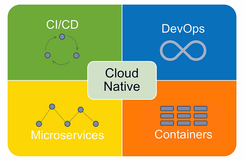
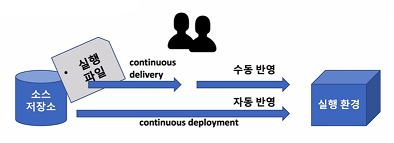
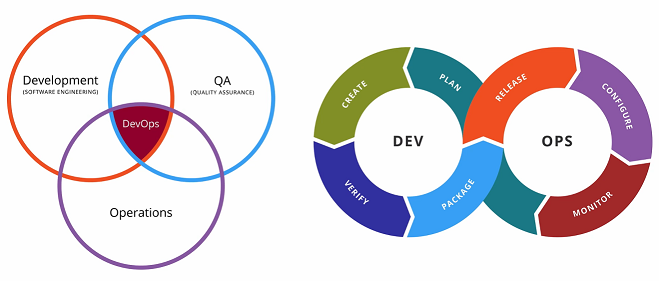
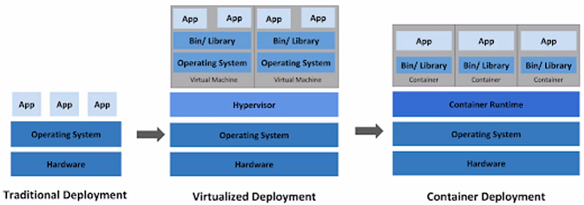

# Cloud Native Application

- Cloud Native Architecture에 의해서 설계되고 구현되는 애플리케이션을 Cloud Native Application이라고 한다.

## Cloud Native Application의 특징

- MicroServices
  - 마이크로서비스로 개발된다.
- CI/CD
  - 마이크로서비스로 개발된 서비스는 CI/CD 시스템을 이용해서 자동으로 통합/빌드/배포하는 과정을 거치게 된다.
- DevOps
  - 마이크로서비스에 문제가 발생하였을 경우 바로 수정해서 배포하는 과정을 반복할 수 있는데 이것을 DevOps라고 한다.
  - DevOps에서는 시스템의 기획/구현/테스트/배포되는 과정을 시스템의 개발이 종료될 때까지 무한반복함으로 인해서 고객이 원하는 최선의 결과물을 만드는데 그 목적을 두고 있다.
- Containers
  - 하나의 애플리케이션을 구성하는 마이크로서비스들을 클라우드 환경에 배포하고 사용하기 위해서는 컨테이너 가상화 기술을 사용한다.

### CI/CD

- 지속적인 통합, CI(Continuous Integration)
  - 하나의 애플리케이션을 여러 개의 팀이나 여러 개발자가 개발하는 있는 경우에 결과물을 통합하기 위한 형상관리를 말하기도 하고, 통합된 코드를 빌드하고 테스트하는 과정 자체를 의미하기도 한다.
  - 통합 서버, 소스 관리(SCM), 빌드 도구, 테스트 도구
  - ex) Jenkins, Team CI, Travis CI
  - CI 시스템은 git과 같은 형상관리 시스템과 연동해서 사용하게 된다.
  - CI 시스템에 파이프라인을 잘 연동하게 되면 개발자가 어떤 코드를 완성한 다음에 git과 같은 형상관리 시스템에 해당 코드를 업로드 커밋함과 동시에 빌드/테스트를 실행해서 다른 쪽의 코드와 문제가 발생하는지 여부를 바로 확인해볼 수 있다.
- 지속적 배포
  - 지속적인 전달, CD(Continuous Delivery)
  - 지속적인 배포, CD(Continuous Deployment)
  - 지속적인 배포를 의미하는 CD에는 두가지 의미(지속적인 전달과 지속적인 배포)를 포함하고 있다.
  - 지속적인 전달과 지속적인 배포는 git과 같은 소스 저장소에 업로드된 소스를 가져와서 패키지화된 형태의 결과물을 실행환경에 어떻게 배포하는지에 따라서 달라진다.
  - 패키지화된 결과물을 실행환경에 수작업으로 배포하는 과정이 필요하다고 한다면 지속적인 전달이라고 볼 수 있다.
  - 패키지화된 결과물을 운영자나 관리자의 개입없이 자동으로 실행환경에 배포할 수 있다면 지속적인 배포라고 볼 수 있다.
  - Pipe line

- 카나리 배포와 블루그린 배포
  - 변경된 시스템을 바로 반영하기 보다는 기존 시스템과 같이 운용해 줌으로서 사용자에게 발생할 수 있는 이질감이나 문제점을 최소화 할 수 있다.
  - 시스템에 완성된 결과물을 배포하기 위해서 카나리 배포, 블루그린 배포와 같은 전략을 선택할 수 있다.
  - 카나리 배포
    - 카나리 배포는 위험을 빠르게 감지할 수 있는 배포 전락이다.
    - 지정한 서버 또는 특정 사용자에게만 배포했다가 정상적이면 전체를 배포한다.
    - 서버 트래픽의 일부를 새 버전으로 분산하여 오류 여부를 확인할 수 있다.
  - 블루그린 배포
    - 신 버전을 배포하고 일제히 전환하여 모든 연결을 신 버전을 바라보게 하는 전략이다.
    - 구 버전, 신 버전 서버를 동시에 나란히 구성하여 배포 시점에 트랙픽이 일제히 전환된다.
    - 빠른 롤백이 가능하고, 운영환경에 영향을 주지 않고 실제 서비스 환경으로 신 버전 테스트가 가능하다.

### DevOps

- DevOps는 Development와 Operation이 합쳐진 용어다.
- 개발조직과 운영조직의 통합을 의미한다.
- 개발조직과 운영조직은 통합은 고객의 요구사항을 빠르게 반영하고, 만족도 높은 결과물을 제시하는 것에 목적을 두고 있다.
- 기존의 Enterprise 애플리케이션들은 고객의 요구사항에 맞춰 도메인을 분석하고, 시스템을 설계, 애플리케이션 구현과 테스트, 배포 과정을 거쳐서 시스템개발을 완료하게 되는데, 이러한 과정은 3개월~6개월 또는 1년 이상의 과정이 소요된다. 개발기간이 길어진다는 것은 변경사항이나 요구사항를 바로 대처하기 어렵다는 단점을 가질 수 있다.
- 자주 고객의 요구사항을 반영하고, 개발된 내용을 자주 테스트하는 것은 전체 개발일정을 더디게 하는 요인이 될 수 있지만, 고객의 요구사항에 맞는 오류없는 완성물이어야 한다.
- 자주 테스트하고, 자주 피드백을 받고, 자주 업데이트하는 과정을 거치면서 전체 개발일정이 완료될 때까지 지속적으로 끊임없이 진행해가는 것을 DevOps라고 한다.
- 클라우드 네이티브 애플리케이션은 이런 DevOps 환경에 맞춰서 서비스의 구조를 작은 단위로 분할할 수 있게 함으로써 더 자주 통합, 더 자주 테스트, 더 자주 배포할 수 있는 구조가 될 수 있다.

### Container 가상화

- 가상화는 클라우드 네이티브 아키텍처의 핵심이다.
- 기종의 로컬 환경에서 유지해야 했던 시스템들을 클라우드 환경으로 이전해서 적은 비용으로 탄력성 있는 시스템을 구축하게 된 배경이 컨테이너 가상화 기술이다.
- 컨테이너 가상화 기술은 하드웨어 가상화, 서버 가상화에 비해서 적은 리소스를 사용하여 가상화 서비스를 구축할 수 있다.

- Traditionl Deployment(전통적인 개발시스템)
  - 전통적인 방식의 개발 시스템은 하드웨어 시스템 위에 운영체제를 설치하고 애플리케이션을 운영한다.
- Virtualized Deployment(가상화 기반 개발시스템)
  - 가상화를 통한 개발 시스템에서는 운영체제 위에 Hypervisor 기술을 통한 가상머신을 기동한다.
  - 가상머신은 호스트 시스템이 가지고 있는 물리적인 하드웨어를 쪼개서 사용하는 개념으로 하나의 가상머신은 독립적인 운영체제를 가지고 실행될 수 있다.
  - 각각의 가상머신에 애플리케이션을 독립적으로 운영할 수 있다.
  - 가상머신에서 작동하는 애플리케이션은 호스트 운영체제에 많은 부하를 주고, 시스템 확장에 한계가 있다.
- Container Deployment(컨테이너 가상화 기반 개발시스템)
  - 컨테이너 가상화 기반 개발시스템은 운영체제 위에 컨테이너 가상화를 위한 서비스를 작동시키고, 공통적인 라이브러리나 리소스를 공유해서 사용한다.
  - 각자 필요한 부분에 대해서만 독립적인 영역에다가 실행할 수 있는 구조가 컨테이너 가상화다.
  - 기존의 하드웨어 가상화 기술보다는 더 적은 리소스를 사용하게 되고, 컨테이너 가상화 위에서 작동되는 서비스들은 가볍고 빠르게 운용할 수 있다는 특징을 가지고 있다.

