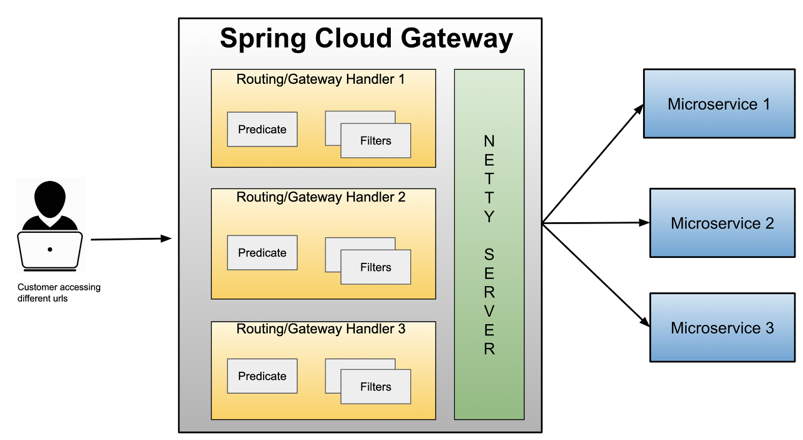
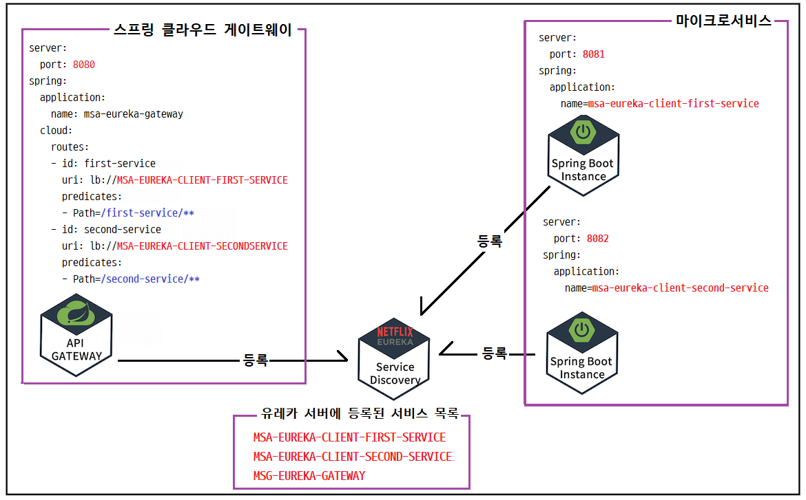
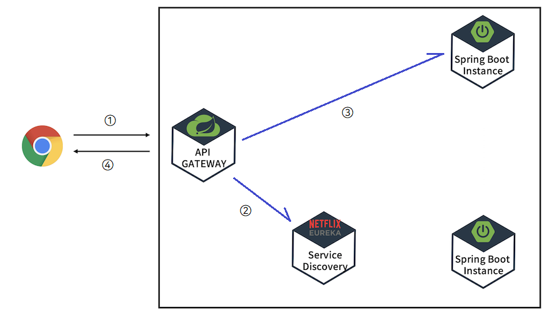

# API Gateway

- 게이트웨이는 클라이언트 요청의 앞단에 위치한다.

## API Gateway의 역할

- 인증 및 권한 부여
- 서비스 검색 통합
- 응답 캐싱
- 정책, 회로 차단기 및 QoS 다시 시도
- 속도 제한
- 부하 분산
- 로깅, 추적, 상관관계
- 헤더, 쿼리 문자열 및 청구 변환
- IP 허용 목록에 추가

## API Gateway를 사용하는 이유

- 유입되는 모든 요청/응답이 통과하기 때문에 인증/보안을 적용하기 좋다.
- 로드밸러서 기능으로 클라이언트의 요청에 대해서 부하분산을 할 수 있다.
- URI에 따라 서비스 엔드포인트를 다르게 가져가는 동적 라우팅이 가능해진다.
- 모든 트래픽이 통과하기 때문에 모니터링 시스템 구성이 단순해진다.
- 동적 라우팅이 가능하므로 신규 스팩을 서비스 일부에만 적용하거나 트래픽을 점진적으로 늘려나가는 테스트를 쉽게 수행할 수 있다.


## Spring Cloud Gateway

- Spring Cloud Gateway는 MSA환경에서 사용하는 API Gateway다.
- Spring Cloud Gateway는 API 라우팅 및 보안, 모니터링/메트릭 등의 기능을 간단하고 효과정인 방법을 제공한다.



## Spring Cloud Gateway로 API Gateway 구축하기

### 의존성

- spring-boot-devtools
- spring-cloud-starter-netflix-eureka-client
- spring-cloud-starter-gateway

### Spring Cloud Gateway 설정하기

- Spring Cloud Gateway 서비스를 유레카 서버에 등록한다.
- Spring Cloud Gateway 라우팅 설정 정보를 등록한다.

```yml
server:
  port: 8080
  
eureka:
  client:
    register-with-eureka: true
    fetch-registry: true
    service-url:
      defaultZone: http://localhost:8761/eureka/

### spring.application.name
###   유레카 서버에 등록되는 서비스이름이다.
### spring.cloud.gateway.routes
###   라우팅 정보를 설정한다. 응답을 보낼 목적지 URI, 필터 항목을 식별하기 위한 ID로  구성된다.
### spring.cloud.gateway.routes.predicates
###   요청을 처리하기 전 HTTP 요청이 정의된 조건에 부합하는지 검사한다.
### spring.cloud.gateway.routes.id
###   라우팅정보를 식별하는 식별자다.
### spring.cloud.gateway.routes.uri
###   목적지 URI다. uri: http://localhost:8081/first-service
### spring.cloud.gateway.routes.prediccates.Path
###   지정된 패턴의 URI요청 유입되면 유레카서버에 등록된 마이크로서비스가 실행된다.
spring:
  application:
    name: msa-eureka-gateway
  cloud:
    gateway:
      routes:
      - id: first-service
        uri: http://localhost:8081/first-service
        predicates:
        - Path=/first-service/**
      - id: second-service
        uri: http://localhost:8081/first-service
        predicates:
        - Path=/second-service/**
```

### 마이크로서비스들의 application.yml 설정

- MSA-EUREKA-CLIENT-FIRST-SERVICE 마이크로서비스 설정

```yml
server:
  port: 8081

### spring.application.name은 서비스 디스커버리에 등록할 클라이언트 서비스 이름이다.
spring:
  application:
    name: msa-eureka-client-first-service
    
### eureka.client.service-url.defaultZone은 클라이언트와 통신할 디스커버리 서버 주소를 설정한다.
eureka:
  client:
    register-with-eureka: true
    fetch-registry: true
    service-url:
      defaultZone: http://localhost:8761/eureka/
```

- MSA-EUREKA-CLIENT-SECOND-SERVICE 마이크로서비스 설정

```yml
server:
  port: 8082

### spring.application.name은 서비스 디스커버리에 등록할 클라이언트 서비스 이름이다.
spring:
  application:
    name: msa-eureka-client-second-service
    
### eureka.client.service-url.defaultZone은 클라이언트와 통신할 디스커버리 서버 주소를 설정한다.
eureka:
  client:
    register-with-eureka: true
    fetch-registry: true
    service-url:
      defaultZone: http://localhost:8761/eureka/
```

### Spring Cloud Gateway와 Eureka Service Discovery 연동



### Spring Cloud Gateway와 Eureka Service Discovery 연동시 요청처리

1. 클라이언트에서 요청이 API Gateway로 유입된다.
2. API Gateway에서 받은 요청을 어떤 인스턴스에서 처리할 수 있는지 Service Discovery에서 찾는다.
3. API Gateway는 클라이언트의 요청을 마이크로서비스 인스턴스로 보낸다.
4. 마이크로서비스 인스턴스의 응답결과를 클라이언트에게 전달한다.


