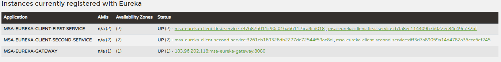
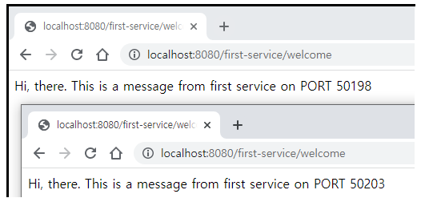

# Spring Cloud Gateway - Load Balancer

- 같은 로직을 수행하는 마이크로서비스가 여러 개 있을 경우 로드밸런서를 구현하여 트래픽을 분산시킨다.

## 마이크로서비스들의 설정변경

### 마이크로서비스들의 application.yml 설정 변경

- msa-eureka-client-first-service, msa-eureka-client-second-service 애플리케이션의 application.yml의 내용에 다음 설정을 반영한다.
- 포트번호를 랜덤포트로 설정한다.
- eureka.instance.instance-id를 지정한다.

```yml
### 포트번호 고정
#server:
#  port: 8081

### 로드밸런스 테스트를 위해서 포트번호를 랜덤하게 설정한다.
server:
  port: 0
  
### spring.application.name은 서비스 디스커버리에 등록할 클라이언트 서비스 이름이다.
spring:
  application:
    name: msa-eureka-client-first-service
    
### eureka.client.service-url.defaultZone은 클라이언트와 통신할 디스커버리 서버 주소를 설정한다.
eureka:
  client:
    register-with-eureka: true
    fetch-registry: true
    service-url:
      defaultZone: http://localhost:8761/eureka/
### 로드밸런스 테스트를 위해서 각 애플리케이션 인스턴스 아이디를 식별하기 위한 설정을 추가한다.
  instance:
    instance-id: ${spring.application.name}:${spring.application.instance_id:${random.value}}    
```

### 마이크로서비스들의 Controller 소스 코드 수정

- 같은 동작을 수행하는 마이크로서비스가 여러 개 실행 중이기 때문에, 로드밸런싱 되어 들어오는 요청이 어떤 포트에 바인딩 서비스가 처리하는 확인하기 위해서 응답 메세지에 마이크로서비스의 포트번호를 포함시킨다.

```java
@RequiredArgsConstructor
@RestController
@RequestMapping("/second-service")
public class SecondServiceController {

  // 로드밸런스 동작 체크를 위해서 추가된 내용
  // application.properties의 환경설정 정보를 제공하는 객체를 주입받는다.
  private final Environment env;

  @GetMapping("/welcome")
  public String welcome() {
    //return "Welcome to the Second service.";
    return String.format("Hi, there. This is a message from second service on PORT %s", env.getProperty("local.server.port"));
  }
}
```

## Spring Cloud Gateway 설정하기

- uri를 앞에 lb:// 접두사를 붙이고, 유레카 디스커버리 서버에 등록되는 마이크로서비스 어플리케이션 서비스 이름을 적는다.

```yml
server:
  port: 8080

spring:
  application:
    name: msa-eureka-gateway
  cloud:
    gateway:
      routes:
      - id: first-service
        uri: lb://MSA-EUREKA-CLIENT-FIRST-SERVICE
        predicates:
        - Path=/first-service/**
      - id: second-service
        uri: lb://MSA-EUREKA-CLIENT-SECOND-SERVICE
        predicates:
        - Path=/second-service/**

eureka:
  client:
    register-with-eureka: true
    fetch-registry: true
    service-url:
      defaultZone: http://localhost:8761/eureka/
```

## 마이크로서비스 여러 개 실행하기

- Command 창에서 mavw로 스프링부트 애플리케이션을 실행시킨다.

```prompt
projects\msa-eureka-client-first-service> mvnw spring-boot:run
projects\msa-eureka-client-first-service> mvnw spring-boot:run

projects\msa-eureka-client-first-service> mvnw spring-boot:run
projects\msa-eureka-client-first-service> mvnw spring-boot:run
```

## 마이크로서비스 로드밸런싱 처리 결과 확인하기

- 유레카 디스커버리 서버에 접속해서 실행중인 마이크로서비스를 확인한다.


- Spring Cloud Gateway를 통해서 같은 내용의 서비스들 간에 요청이 분산처리되는 것을 확인한다.

