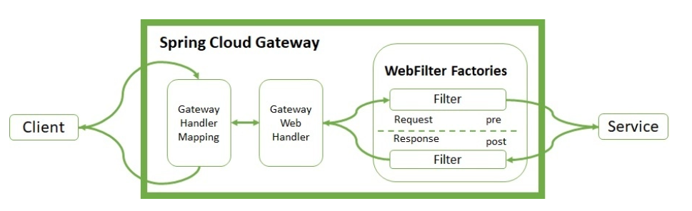
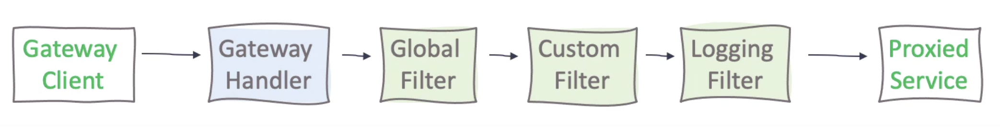
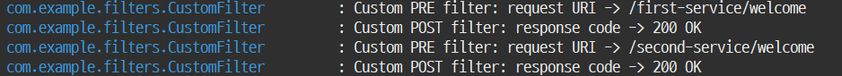

# 마이크로서비스에 필터 적용하기

- Spring Cloud Gateway는 마이크로서비스에가 자주 사용되는 지능형 프록시 서버다.
- 단일 진입점으로써 클라이언트의 요청을 투명하게 중앙 집중화하고 적절한 마이크로서비스로 라우팅한다.
- Spring Cloud Gateway는 프록시된 마이크로서비스에 대한 전처리/후처리(HTTP 요청과 HTTP 응답과 상호작용하는 작업) 작업을 지원하는 WebFilter 팩토리를 제공한다.
- Spring Cloud Gateway에서는 내장된 WebFilter 팩토리와 사용자 정의 필터를 사용할 수 있다.

## WebFilter Factories

- WebFilter(GatewayFilter) Factories는 인바운드 HTTP 요청과 아웃바운드 HTTP 응답을 수정할 수 있다.

- 게이트웨이 핸들러 매핑은 클라이언트의 요청을 관리한다.
- 게이트웨이 핸들러 매핑은 설정된 경로와 일치하는 요청인지 확인하고, 지정된 경로에 대한 필터 체인을 실행하기 위해서 웹 핸들러에 요청을 보낸다.
- 입력필터는 마이크로서비스 실행 전에 실행되고, 출력필터는 마이크로서비스 실행후에 실행된다.
- 스프링 클라우드 내장 WebFilter
  - ADD : AddRequestHeader, AddRequestParameter
  - Map : MapRequestHeader
  - Set or Replace : SetRequestHeader, SetResponseHeader
  - Remove : RemoveRequestHeader, RemoveRequestParameter, RemoveResponseHeader
  - Rewrite : RewriteResponseHeader

## WebFilter 실행우선 순위



- 우선 순위는 order 인자값을 통해서 변경가능하다.

## 사용자정의 WebFilter 적용하기

### 사용자정의 CustomFilter 구현

- Spring Cloud Gateway 프로젝트에 사용자정의 CustomFilter를 구현한다.
- AbstractGatewayFilterFactory 클래스를 상속받고, 생성자 메소드와 GatewayFilter apply(Config config) 메소드를 재정의한다.
- apply() 메소드에 전처리 작업과 후처리 작업을 구현한다.

```java
public GatewayFilter apply(Config config) {
  return (exchange, chain) -> {
    // 전처리 작업 구현
    
    return chain.filter(exchange).then(Mono.fromRunnable(() -> {
      // 후처리 작업 구현
    }));
  }
}
```

- 사용자정의 CustomerFilter 소스 코드
  - 전처리 작업에서는 요청 URI를 로그로 출력한다.
  - 후처리 작업에서는 HTTP 응답코드를 로그로 출력한다.

```java
package com.example.filters;

import org.springframework.cloud.gateway.filter.GatewayFilter;
import org.springframework.cloud.gateway.filter.factory.AbstractGatewayFilterFactory;
import org.springframework.http.server.reactive.ServerHttpRequest;
import org.springframework.http.server.reactive.ServerHttpResponse;
import org.springframework.stereotype.Component;

import lombok.extern.slf4j.Slf4j;
import reactor.core.publisher.Mono;

@Component
@Slf4j
public class CustomFilter extends AbstractGatewayFilterFactory<CustomFilter.Config> {

  public CustomFilter() {
    super(Config.class);
  }

  @Override
  public GatewayFilter apply(Config config) {

    // 전처리 코드
    return (exchange, chain) -> {
      ServerHttpRequest request = exchange.getRequest();
      ServerHttpResponse response = exchange.getResponse();
      log.info("Custom PRE filter: request URI -> {}", request.getURI().getPath());

      // 후처리 코드
      return chain.filter(exchange).then(Mono.fromRunnable(() -> {
        log.info("Custom POST filter: response code -> {}", response.getStatusCode());
      }));
    };
  }

  public static class Config {
    // Put the configuration properties
  }
}

```

### application.yml 기반 필터 설정

- Spring Cloud Gateway 프로젝트의 application.yml에 사용자정의 필터 설정을 추가한다.
- 각각의 마이크로서비스 별로 사용자정의 필터를 설정할 수 있다.

```yml
### spring.application.name
###   유레카 서버에 등록되는 서비스이름이다.
### spring.cloud.gateway.routes
###   라우팅 정보를 설정한다. 응답을 보낼 목적지 URI, 필터 항목을 식별하기 위한 ID로  구성된다.
### spring.cloud.gateway.routes.predicates
###   요청을 처리하기 전 HTTP 요청이 정의된 조건에 부합하는지 검사한다.
### spring.cloud.gateway.routes.filters
###   마이크로서비스 전/후에 실행할 작업이 구현된 필터를 지정한다.
spring:
  application:
    name: msa-eureka-gateway
  cloud:
    gateway:
      routes:
      - id: first-service
        uri: lb://MSA-EUREKA-CLIENT-FIRST-SERVICE
        predicates:
        - Path=/first-service/**
        filters:
        - CustomFilter
      - id: second-service
        uri: lb://MSA-EUREKA-CLIENT-SECOND-SERVICE
        predicates:
        - Path=/second-service/**
        filters:
        - CustomFilter
```

### 사용자 정의 필터 확인하기

- localhost:8080/first-service/welcome 혹은 localhost:8080/second-service/welcome 요청을 서버로 보낸다.


