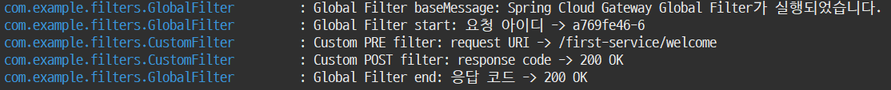

# 글로벌 필터

- 모든 마이크로서비스에 공통으로 적용되는 필터다.

## 사용자정의 글로벌 필터 구현하기

- AbstractGatewayFilterFactory 클래스를 상속받고, 생성자 메소드와 GatewayFilter apply(Config config) 메소드를 재정의한다.
- Config 클래스는 application.yml에서 설정한 값을 전달받는다.

```java
package com.example.filters;

import org.springframework.cloud.gateway.filter.GatewayFilter;
import org.springframework.cloud.gateway.filter.factory.AbstractGatewayFilterFactory;
import org.springframework.http.server.reactive.ServerHttpRequest;
import org.springframework.http.server.reactive.ServerHttpResponse;
import org.springframework.stereotype.Component;

import lombok.Getter;
import lombok.Setter;
import lombok.extern.slf4j.Slf4j;
import reactor.core.publisher.Mono;

@Component
@Slf4j
public class GlobalFilter extends AbstractGatewayFilterFactory<GlobalFilter.Config> {

  public GlobalFilter() {
    super(Config.class);
  }

  @Override
  public GatewayFilter apply(Config config) {
    return ((exchange, chain) -> {
      ServerHttpRequest request = exchange.getRequest();
      ServerHttpResponse response = exchange.getResponse();

      log.info("Global Filter baseMessage: {}", config.getBaseMessage());

      if (config.isPreLogger()) {
        log.info("Global Filter start: 요청 아이디 -> {}", request.getId());
      }

      // Mono는 Spring WebFlex에서 지원하는 객체다.
      return chain.filter(exchange).then(Mono.fromRunnable(() -> {
        if (config.isPostLogger()) {
        log.info("Global Filter end: 응답 코드 -> {}", response.getStatusCode());
      }
    }));
  });
}

// Config 클래스는 application.yml에서 설정된 값을 전달받는 객체다.
  @Getter @Setter
  public static class Config {
    private String baseMessage;
    private boolean preLogger;
    private boolean postLogger;
  }
}
```

## application.yml 기반 필터 설정

- 글로벌 필터를 등록한다.
- 글로벌 필터의 Config객체에 전달할 값을 설정한다.

```yml
### spring.cloud.gateway.default-filters
###   글로벌 필터를 정의한다.
### spring.cloud.gateway.default-filters.name
###   글로벌 필터의 이름을 지정한다.
### spring.cloud.gateway.default-filters.args
###   글로벌 필터의 Config객체에 전달할 값을 설정한다.
###   args의 baseMessage, preLogger, postLogger은 GlobalFilte.Config객체의 멤버변수 이름이다.
### spring.cloud.gateway.routes.filters
###   마이크로서비스 전/후에 실행할 작업이 구현된 필터를 지정한다.
spring:
  application:
    name: msa-eureka-gateway
  cloud:
    gateway:
      default-filters:
      - name: GlobalFilter
        args:
          baseMessage: Spring Cloud Gateway Global Filter가 실행되었습니다.
          preLogger: true
          postLogger: true
      routes:
      - id: first-service
        uri: lb://MSA-EUREKA-CLIENT-FIRST-SERVICE
        predicates:
        - Path=/first-service/**
        filters:
        - CustomFilter
      - id: second-service
        uri: lb://MSA-EUREKA-CLIENT-SECOND-SERVICE
        predicates:
        - Path=/second-service/**
        filters:
        - CustomFilter
```

## 글로벌 필터 확인하기

- 아래의 URL로 요청을 보내서 글로벌 필터의 실행을 확인한다.

```text
http://localhost:8080/first-service/welcome
http://locaalhost:8080/second-service/welcome
```


