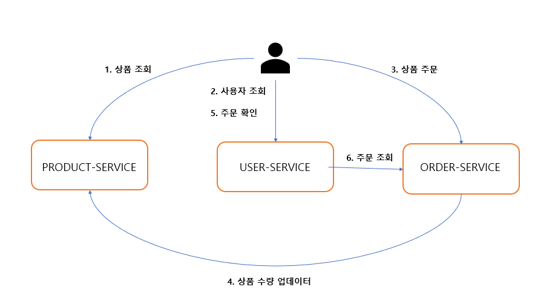
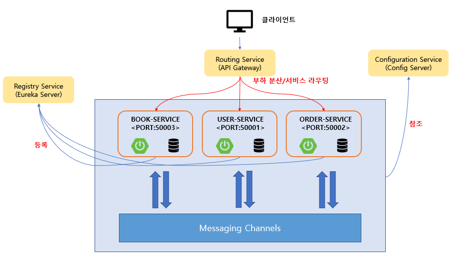
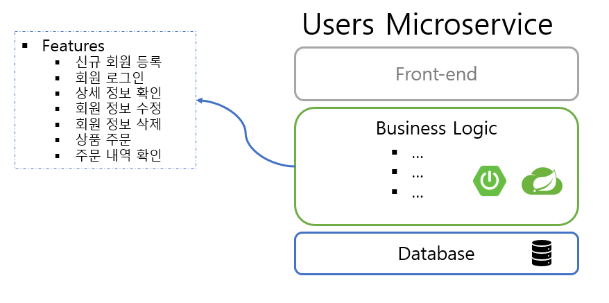

# 북스토어 마이크로서비스

## 북스토어 애플리케이션의 개요



## 북스토어 애플리케이션의 구성



## 북스토어 애플리케이션 구성요소

| 구성요소 | 설명 |
| --- | --- |
| Git Repository | 마이크로서비스 소스 관리 및 프로파일 관리 |
| Config Server | Git 저장소에 등록된 프로파일 정보 및 설정 정보 |
| Eureka Server | 마이크로서비스 등록 및 검색 |
| API Gateway Server | 마이크로서비스 부하 분산 및 서비스 라우팅 |
| Microservices | 회원 마이크로서비스, 주문 마이크로서비스, 책 마이크로서비스 |
| Queuing System | 마이크로서비스 간 메세지 발행 및 구독|

## 북스토어 애플리케이션 APIs

| 마이크로서비스 | HTTP Method | RESTful API | Description |
| --- | --- | --- | --- |
| Book Service | GET | /book-service/books | 책 목록 제공 |
| User Service | POST | /user-service/users | 사용자 정보 등록 |
| User Service | GET | /user-service/users | 전체 사용자 조회 |
| User Service | GET | /user-service/users/{user_id} / 사용자 정보, 주문 내역 조회 |
| Order Service | POST | /order-service/users/{user_id}/orders | 주문 등록 |
| Order Service | GET | /order-service/users/{user_id}/orders | 주문 확인 |

### Users Microservice

#### Users Microservice 구성



#### Users Microservice APIs

| 기능 | HTTP Method | URI |
| --- | --- | --- |
| 사용자 정보 등록 | POST | /user-service/users |
| 전체 사용자 조회 | GET | /user-service/users |
| 사용자 정보, 주문 내역 조회 | GET | /user-service/users/{user_id} |
| 작동 상태 확인 | GET | /user-service/users/health_check |
| 환영 메세지 | GET | /user-service/welcome |

- 사용자 정보 등록시 요청 데이터

```json
{
    "name": "홍길동",
    "email": "hong@gmail.com",
    "password": "zxcv1234"
}
```

- 사용자 정보 조회, 주문내역 조회 응답 데이터

```json
{
    "userId": "xxxxx-xxxx-xxxx-xxxx-xxxxxxxx",
    "name": "홍길동",
    "email": "hong@gmail.com",
    "orders": []
}
```

