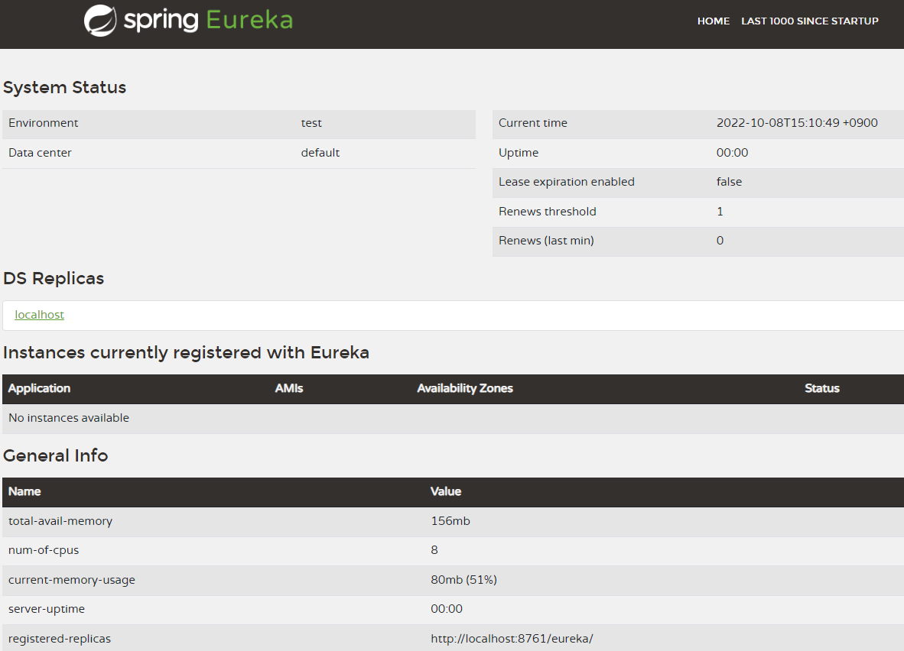

# 북스토어 유레카 서버 

## 프로젝트 생성

- 프로젝트명
  - eureka-server
- 스프링부트
  - 2.6.12
- 스프링부트 스타터 의존성
  - Eureka Server
```xml
<dependency>
	<groupId>org.springframework.cloud</groupId>
	<artifactId>spring-cloud-starter-netflix-eureka-server</artifactId>
</dependency>
```
- 메인 클래스 정의
```java
import org.springframework.boot.SpringApplication;
import org.springframework.boot.autoconfigure.SpringBootApplication;
import org.springframework.cloud.netflix.eureka.server.EnableEurekaServer;

@SpringBootApplication
// 유레카서버를 활성화시킨다.
@EnableEurekaServer
public class EurekaServerApplication {

	public static void main(String[] args) {
		SpringApplication.run(EurekaServerApplication.class, args);
	}

}
```
- application.yml
```yml
# 유레카 서버의 포트번호 지정
server:
  port: 8761
  
# 마이크로서비스 애플리케이션에서 이 애플리케이션을 식별하는 이름
spring:
  application:
    name: bookstore-eureka-server
    
# 이 애플리케이션은 유레카서버이기 때문에 유레카 클라이언트로 등록시키지 않고, 레지스트리 정보를 요청하지 않는다.
eureka:
  client:
    register-with-eureka: false
    fetch-registry: false
```

## 유레카 서버 접속하기

- 접속 URL
```text
http://localhost:8761
```
- 유레카서버 홈
