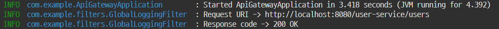

# 글로벌 로깅 필터 

## 글로벌 로깅 필터 구현하기

- 로깅필터는 요청 URI와 응답코드를 로그로 출력하는 필터다.

### GlobalLogginFilter.java 구현하기

- 스프링부트 스타터 의존성
  - Lombok
- api-gateway 프로젝트에 사용자정의 필터를 정의한다.
- AbstractGatewayFilterFactory 클래스를 상속받아서 정의한다.
- Config 클래스는 Configuration properties(application.properties나 application.yml)의 설정값을 전달받는 객체다.

```java
import org.springframework.cloud.gateway.filter.GatewayFilter;
import org.springframework.cloud.gateway.filter.factory.AbstractGatewayFilterFactory;
import org.springframework.http.server.reactive.ServerHttpRequest;
import org.springframework.http.server.reactive.ServerHttpResponse;
import org.springframework.stereotype.Component;

import lombok.extern.slf4j.Slf4j;
import reactor.core.publisher.Mono;

@Component
@Slf4j
public class GlobalLoggingFilter extends AbstractGatewayFilterFactory<GlobalLoggingFilter.Config> {

	public GlobalLoggingFilter() {
		super(Config.class);
	}
	
	@Override
	public GatewayFilter apply(Config config) {
		return (exchange, chain) -> {
			ServerHttpRequest request = exchange.getRequest();
			ServerHttpResponse response = exchange.getResponse();
			
			log.info("Request URI -> {}", request.getURI());
			
			return chain.filter(exchange).then(Mono.fromRunnable(() -> log.info("Response code -> {}", response.getStatusCode())));
		};
	}
	
	public static class Config {
		
	}
}
```

### application에 글로벌 필터 설정 추가하기

```yml     
spring:
  application:
    name: gateway-service
  cloud:
    gateway:
# 글로벌 필터 설정을 추가한다.
      default-filters:
        - name: GlobalLoggingFilter 
```

### 글로벌 필터 실행 테스트하기

- Postman에서 회원가입, 로그인을 테스트한다.

