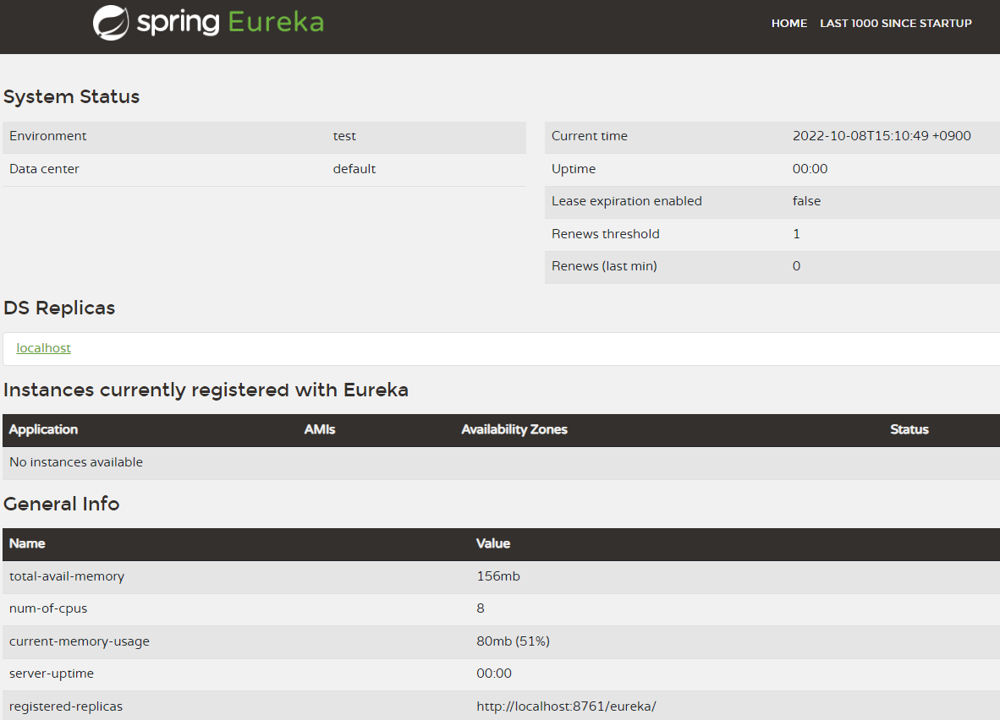

# 북스토어 유레카 서버

## 프로젝트 생성

- 프로젝트명
  - eureka-server
- 스프링부트
  - 2.6.12
- 스프링부트 스타터 의존성
  - Eureka Server

```xml
<dependency>
  <groupId>org.springframework.cloud</groupId>
  <artifactId>spring-cloud-starter-netflix-eureka-server</artifactId>
</dependency>
```

- 메인 클래스 정의

```java
@SpringBootApplication
// 유레카서버를 활성화시킨다.
@EnableEurekaServer
public class EurekaServerApplication {

  public static void main(String[] args) {
    SpringApplication.run(EurekaServerApplication.class, args);
  }

}
```

- application.yml 설정하기

```yml
# 유레카 서버의 포트번호 지정
server:
  port: 8761
  
# 마이크로서비스 애플리케이션에서 이 애플리케이션을 식별하는 이름
spring:
  application:
    name: eureka-server
    
# 이 애플리케이션은 유레카서버이기 때문에 유레카 클라이언트로 등록시키지 않고, 레지스트리 정보를 요청하지 않는다.
# register-with-eureka는 유레카 서버(레지스트리)에 이 애플리케이션을 유레카 클라이언트로 등록할지 여부를 지정한다.
# 이 애플리케이션은 유레카서버(레지스트리)로 동작하기 때문에 레지스트리에 등록할 필요가 없다.
# fetch-registry는 레지스트리에서 정보를 가져올지 여부를 지정한다.
# 이 애플리케이션은 유레카서버(레지스트리)로 동작하기 때문에 레지스트리 정보를 가져올 필요가 없다.
eureka:
  client:
    register-with-eureka: false
    fetch-registry: false
```

## 유레카 서버 접속하기

- 유레카 서버 접속 URL

```text
http://localhost:8761
```

- 유레카서버 홈


  - 현재는 등록된 마이크로서비스가 없기 때문에 **Instances currently registered with Eureka** 항목이 비어 있다.
