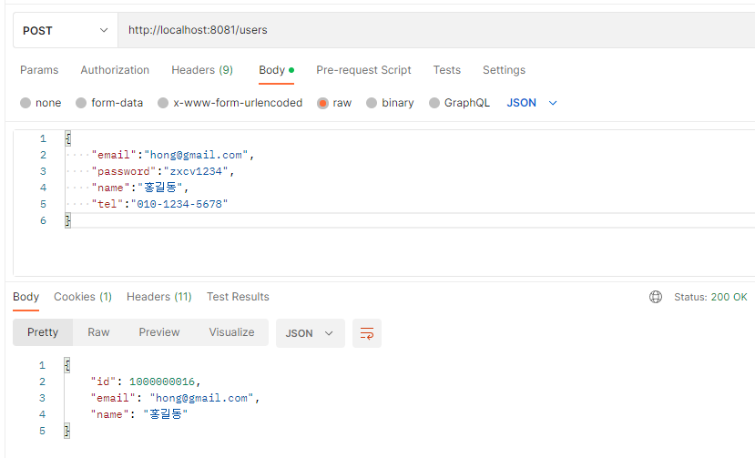

# 북스토어 유저 서비스 구현

## 공통 클래스

- 모델매퍼유틸 클래스
  - 소스 객체의 프로퍼티를 대상 객체로 복사한다.
  - 의존성 추가

```xml
<dependency>
  <groupId>org.modelmapper</groupId>
  <artifactId>modelmapper</artifactId>
  <version>3.0.0</version>
</dependency>
```

```java
public class ModelMapperUtil {

  private static ModelMapper modelMapper;
  static {
    modelMapper = new ModelMapper();
    modelMapper.getConfiguration().setMatchingStrategy(MatchingStrategies.STRICT);
  }

  public static <T> T map(Object source, Class<? extends T> destination) {
    return modelMapper.map(source, destination);
  }
}
```

## 회원가입

### 컨트롤러 클래스 정의

```java
@RestController
@RequestMapping("/users")
@RequiredArgsConstructor
public class UserController {

  private final UserService userService;
	@PostMapping
	public ResponseEntity<ResponseUser> createUser(@RequestBody RequestUser requestUser) {
		UserDto userDto = ModelMapperUtil.map(requestUser, UserDto.class);
		userDto = userService.createUser(userDto);
		ResponseUser responseUser = ModelMapperUtil.map(userDto, ResponseUser.class);
		
		return ResponseEntity.ok(responseUser);
	}
	
}

```

### 서비스 인터페이스와 구현클래스 정의

```java
public interface UserService {
  UserDto createUser(UserDto userDto);
}
```

```java
@Service
@RequiredArgsConstructor
public class UserServicImpl implements UserService {

	private final UserMapper userMapper;
	
	@Override
	public UserDto createUser(UserDto userDto) {
		User user = ModelMapperUtil.map(userDto, User.class);
		userMapper.insertUser(user);
		userDto.setId(user.getId());

		return userDto;
	}
}
```

### 매퍼 인터페이스와 매퍼파일 정의

- 매퍼 인터페이스

```java
@Mapper
public interface UserMapper {
	void insertUser(User user);
}
```

- 매퍼파일

```xml
<mapper namespace="com.example.mapper.UserMapper">
	
	<insert id="insertUser" parameterType="User">
		<selectKey keyProperty="id" resultType="int" order="BEFORE">
			select USERS_SEQ.nextval from dual
		</selectKey>
		insert into users
		(user_id, user_email, user_password, user_name, user_tel)
		values
		(#{id}, #{email}, #{password}, #{name}, #{tel})
	</insert>
</mapper>
```

### Request와 DTO 클래스 정의

- User.java
  - USERS 테이블정보를 표현한다.

```java
@Alias("User")
public class User {

	private int id;
	private String email;
	private String password;
	private String name;
	private String tel;
	private int point;
	private String disabled;
	private Date createdDate;
	private Date updatedDate;
	private String role;
}
```

- RequestUser.java
  - 회원가입 요청정보를 표현한다.

```java
public class RequestUser {

	private String email;
	private String password;
	private String name;
	private String tel;
	
}
```

- ResponseUser.java
  - 회원가입 응답정보를 표현한다.

```java
public class ResponseUser {

	private int id;
	private String email;
	private String name;
}
```

- UserDto.java
  - UserRequest.java와 User.java를 연결한다.

```java
public class UserDto {

	private int id;
	private String email;
	private String password;
	private String name;
	private String tel;
}
```

## 회원가입 실행

- Postman으로 회원가입 요청을 보내고 응답 확인하기
- port번호는 변경될 수 있음

