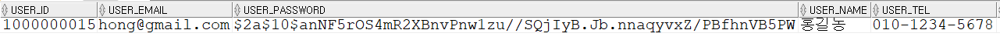

# Spring Security와 로그인

## Spring Security 연동

### Spring Security 연동하기

1. 애플리케이션에 spring security 의존성을 추가한다.
2. **WebSecurityConfigurerAdapter**를 상속받은 Security Configuration 클래스를 작성한다.
3. Security Configuration 클래스에 **@EnableWebSecurity**를 추가한다.
4. Authentication - **Configure(AuthenticationManagerBuilder auth)** 메소드를 재정의한다.
5. Password Encode를 위한 BCryptPasswordEncoder 빈을 등록한다.
6. Authorization - **configure(HttpSecurity http)** 메소드를 재정의한다.

### 스프링 스타터 의존성 추가

- Spring Security

```xml
<dependency>
  <groupId>org.springframework.boot</groupId>
  <artifactId>spring-boot-starter-security</artifactId>
</dependency>
```

### Spring Security의 주요 APi

- Authentication
  - 인증객체다.
	- 당신이 누구인지 증명하는 객체다.
		- 사용자의 인증정보를 저장하는 토큰 객체다.
		- 사용자 인증요청이 접수되면 **사용자계정**과 **비밀번호**를 담고 인증을 위해 전달된다.
		- 사용자 인증이 완료되면 최종 인증결과(user객체와 권한정보)를 담고 **SecurityContext**에 저장되어 전역적으로 참조가 가능하다.
	- Authentication 객체의 주요 구성요소
		- principal: 사용자 계정 혹은 User객체
		- credentials: 사용자 비밀번호
		- authorities: 인증된 사용자의 권한 목록
		- details: 인증 부가 정보
		- authenticated: 인증여부
- AuthenticationManager
	- 인증관리자 객체다.
	- 필터로부터 인증저치를 지시받으면 인증처리자(AuthenticationProvider)들 중에서 현재 인증처리를 할 수 있는 Provider에게 인증처리를 수행하게 하고 인증처리가 완료되면 반환받은 Authentication객체를 필터로 전달한다.
- AuthenticationProvider
	- 인증처리를 담당하는 객체다.
	- 사용자 계정 검증, 비밀번호 검증, 추가 검증 작업을 수행한다.
	- 사용자 계정 검증
		- UserDetailsService 인터페이스에 인증을 요구하는 사용자 정보를 조회한다
			- 존재할 경우 UserDetials객체를 반환한다.
			- 존재하지 않은 경우 UserNotFoundException을 던진다.
	- 비밀번호 검증
		- 반환된 UserDetails에 저장된 비밀번호와 로그인시 입력한 비밀번호가 일치하는지 비교한다.
			- 일치하지 않는 경우 BadCredentiationException을 던진다.
	- 사용자 검증(사용자 계정 검증, 비밀번호 검증, 추가 검증)이 모두 성공하면 최종적으로 Authentication(인증된 사용자정보, 사용자 권한 목록)객체를 AuthenticationManager에 전달한다.
- UsernamePasswordAuthenticationFilter
	1. 전달받은 **Username(사용자 계정: 아이디 혹은 이메일)**과 **비밀번호**롤 가지고 Authentication객체를 생성한다.
	2. **AuthenticationManager**에게 인증처리를 위임한다.
	3. **AuthenticationManager**는 **AuthenticationProvider**에게 실제 인증처리를 위임한다.
	4. **AuthenticattionProvider**은 **UserDetailsService**를 활용해서 사용자 계정과 비밀번호를 검증한다.
- UserDetailsService
	- **UserDedails** 객체를 반하는 메소드가 정의된 인터페이스다.
	- 일반적으로 UserDetialsService 인터페이스를 구현한다.
- UserDetails
	- 인증에 성공한 사용자정보와 권하는 정보를 표현하는 인터페이스다.


## 회원가입시 비밀번호 암호화하기 

### BcryptPasswordEncoder 빈 등록하기

- BcryptPasswordEncoder
  - Password를 해싱하기 위해 BCrypt 알고리즘을 사용한다.
  - Random Salt를 부여하여 여러 번 Hash를 적용한 암호화방식이다.

```java
@SpringBootApplication
public class UserServiceApplication {

	public static void main(String[] args) {
		SpringApplication.run(UserServiceApplication.class, args);
	}
	
  // PasswordEncoder 인터페이스 구현객체를 스프링의 빈으로 등록한다.
	@Bean
	PasswordEncoder passwordEncoder() {
		return new BCryptPasswordEncoder();
	}
}
```

### WebSecurity 클래스 작성하기

```java
@RequiredArgsConstructor
@EnableWebSecurity
public class WebSecurity extends WebSecurityConfigurerAdapter {
	
	@Override
	protected void configure(HttpSecurity http) throws Exception {
		http.csrf().disable();
		http.authorizeHttpRequests().antMatchers("/users/**").permitAll();
	}
}
```

### UserServiceImpl.java 클래스에서 회원가입시 비밀번호를 암호화하기

```java
@Service
@RequiredArgsConstructor
public class UserServicImpl implements UserService {

	private final UserMapper userMapper;
  // PasswordEncoder 구현객체를 주입받는다.
	private final PasswordEncoder passwordEncoder;
	
	@Override
	public UserDto createUser(UserDto userDto) {
		User user = ModelMapperUtil.map(userDto, User.class);
    // 비밀번호를 BCryptPasswordEncoder로 인코딩한다.
		user.setPassword(passwordEncoder.encode(user.getPassword()));
		userMapper.insertUser(user);
		userDto.setId(user.getId());

		return userDto;
	}
}
```

### 회원가입 확인

- Postman으로 회원가입 요청을 보내고 응답 확인하기


- 비밀번호 암호화 확인하기



## 로그인하기

### RequestLogin.java 클래스 정의하기

- 이메일, 비밀번호 정보를 표현하는 클래스다.

```java
public class RequestLogin {

	private String email;
	private String password;
}
```

### UserDetails 인터페이스 구현 객체

	- User.java 클래스에 UserDetails 인터페이스 구현객체를 반환하는 메소드를 정의한다.
  - UserDetails 인터페이스는 Spring Security에서 사용자의 정보를 표현하는 인터페이스다.
	- 주요 메소드
	
	메소드 | 리턴타입 | 설명 | 기본값
	--- | --- | --- | ---
	getAuthorities() | Collection<? extends GrantedAuthority> | 계정의 권한 목록 반환 | 없음
	getPassword() | String | 계정의 비밀번호를 반환 | 없음
	getUsername() | String | 계정의 고유한 값을 반환(아이디, 이메일 등) | 없음
	isAccountNonExpired() | boolean | 계정의 만료여부 반환 | true
	isAccountNonLocked() | boolean | 계정의 잠김여부 반환 | true
	isCredentialsNonExpired() | boolean | 비밀번호 만료여부 반환 | true
	isEnabled() | boolean | 계정의 활성화 여부 반환 | true

	- User.java 클래스에 UserDetails 객체를 반환하는 메소드 정의

```java
@Alias("User")
public class User {

	private int id;
	private String email;
	private String password;
	private String name;
	private String tel;
	private int point;
	private String disabled;
	private Date createdDate;
	private Date updatedDate;
	private String role;
	
	public UserDetails getUserDetails() {
		return new UserDetails() {

			private static final long serialVersionUID = -8970642312078297363L;

			public Collection<? extends GrantedAuthority> getAuthorities() {
				return List.of(new SimpleGrantedAuthority(role));
			}

			public String getPassword() {
				return password;
			}

			public String getUsername() {
				return email;
			}

			public boolean isAccountNonExpired() {
				return true;
			}

			public boolean isAccountNonLocked() {
				return true;
			}

			public boolean isCredentialsNonExpired() {
				return true;
			}

			public boolean isEnabled() {
				return "N".equals(disabled);
			}
		};
	}
}
```

### UserDetialsService 인터페이스 구현 객체 정의하기

- UserService.java는 UserDetailsService 인터페이스를 상속받는다.

```java
public interface UserService extends UserDetailsService {

	UserDto createUser(UserDto userDto);
	User getUserByEmail(String email);
}
```

- UserServiceImpl.java 클래스에 **UserDetails loadUserByUsername(String username)** 메소드 재정의하기

```java
@Service
@RequiredArgsConstructor
public class UserServicImpl implements UserService {

	private final UserMapper userMapper;
	private final PasswordEncoder passwordEncoder;
	
	@Override
	public UserDto createUser(UserDto userDto) {
		User user = ModelMapperUtil.map(userDto, User.class);
		user.setPassword(passwordEncoder.encode(user.getPassword()));
		userMapper.insertUser(user);
		userDto.setId(user.getId());

		return userDto;
	}
	
	@Override
	public User getUserByEmail(String email) {
		return userMapper.getUserByEmail(email);
	}
	
	@Override
	public UserDetails loadUserByUsername(String email) throws UsernameNotFoundException {
		User user = userMapper.getUserByEmail(email);
		if (user == null) {
			throw new UsernameNotFoundException(email);
		}
		
		return user.getUserDetails();
	}
}
```

### 매퍼 인터페이스와 매퍼 파일에 회원정보 조회 추가하기

- 매퍼 인터페이스

```java
@Mapper
public interface UserMapper {
	void insertUser(User user);
	User getUserByEmail(String email);
}
```

- 매퍼 파일

```xml
<select id="getUserByEmail" parameterType="string" resultType="User">
	select 
		user_id as id,
		user_email as email,
		user_password as password,
		user_name as name,
		user_tel as tel,
		user_point as point,
		user_disabled as disabled,
		user_created_date as createdDate,
		user_updated_date as updatedDate,
		user_role as "role"
	from
		users
	where
		user_email = #{value}
</select>
```

### AuthenticationFilter 정의하기
  - Spring Security를 이용한 로그인 요청 시 실행되는 사용자 정의 클래스다.
	- UsernamePasswordAuthenticationFilter를 상속받는다.
	  - 아이디와 비밀번호로 사용자 인증작업을 수행하는 필터 클래스다.
	- 주요 메소드
	
메소드 | 리턴타입 | 설명
--- | --- | --- 
attempAuthentication(HttpServletRequest req, HttpServletResponse res) | Authentication | 인증 요청시 실행되는 메소드다. 아이디, 비밀번호 정보를 사용자를 인증하고, Authentication을 반환한다
successfulAuthentication(HttpServletRequest req, HttpServletResponse res, FilterChain chain, Authentication authResult) | void | 인증 성공시 실행되는 메소드다. 

```java
public class AuthenticationFilter extends UsernamePasswordAuthenticationFilter {
	
	private final UserService userService;
	private final Environment env;
	
	public AuthenticationFilter(AuthenticationManager authenticationManager, UserService userService, Environment env) {
		super.setAuthenticationManager(authenticationManager);
		this.userService = userService;
		this.env = env;
	}
	
	@Override
	public Authentication attemptAuthentication(HttpServletRequest request, HttpServletResponse response)
			throws AuthenticationException {
		try {
			// HttpServletRequest객체의 body부 내용을 읽어서 RequestLogin객체에 저장하고 반환한다.
			RequestLogin requestLogin = ModelMapperUtil.map(request.getInputStream(), RequestLogin.class);
			// RequestLogin객체에 저장된 이메일과 비밀번호로 UsernamePasswordAuthenticationToken객체를 생성한다.
			UsernamePasswordAuthenticationToken usernamePasswordAuthenticationToken = new UsernamePasswordAuthenticationToken(requestLogin.getEmail(), requestLogin.getPassword());
			// 인증관리자의 authenticate(Authentication authentication) 메소드에 이메일과 비밀번호가 포함된 UsernamePasswordAuthenticationToken객체를 전달하고 인증처리를 요청한다.
			// 인증이 완료되면 인증된 사용자정보과 권한정보가 포함된 Authentication객체를 반환한다. 
			return getAuthenticationManager().authenticate(usernamePasswordAuthenticationToken);
		} catch (IOException ex) {
			throw new PreAuthenticatedCredentialsNotFoundException("인증에 필요한 정보를 찾을 수 없습니다.", ex);
		}
	}
	
	@Override
	protected void successfulAuthentication(HttpServletRequest request, HttpServletResponse response, FilterChain chain,
			Authentication authResult) throws IOException, ServletException {
		// 인증 성공시 구현하는 메소드
	}
}

```

### WebSecurity 클래스에 사용자 정의 AuthenticationFilter 추가하기

- 주요 메소드

메소드 | 리턴타입 | 설명
--- | --- | ---
configure(HttpSecurity http) | void | 이 메소드에서는 보안 사항을 설정한다.
configure(AuthenticationManagerBuilder auth) | void | 이 메소드에서는 AuthenticationProvider를 구현한 구현체와 UserDetailsService를 구현한 구현체를 조합한다.


```java
@RequiredArgsConstructor
@EnableWebSecurity
public class WebSecurity extends WebSecurityConfigurerAdapter {
	
	private final PasswordEncoder passwordEncoder;
	private final UserService userService;
	
	@Override
	protected void configure(HttpSecurity http) throws Exception {
		http.csrf().disable();
		http.authorizeHttpRequests().antMatchers("/users/**").permitAll()
		.and()
		.addFilter(getAuthenticationFilter());
	}
	
	@Override
	protected void configure(AuthenticationManagerBuilder auth) throws Exception {
		auth.userDetailsService(userService).passwordEncoder(passwordEncoder);
	}
	
	// 사용자정의 AuthenticationFilter를 반환한다.
	private AuthenticationFilter getAuthenticationFilter() throws Exception {
		return new AuthenticationFilter(authenticationManager(), userService);
	}
}
```