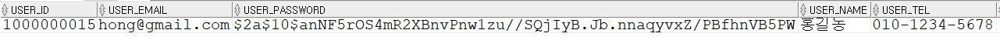

# Spring Security와 비밀번호 암호화

## Spring Security 연동

### Spring Security 연동하기

1. 애플리케이션에 spring security 의존성을 추가한다.
2. **WebSecurityConfigurerAdapter**를 상속받은 Security Configuration 클래스를 작성한다.
3. Security Configuration 클래스에 **@EnableWebSecurity**를 추가한다.
4. Authentication - **Configure(AuthenticationManagerBuilder auth)** 메소드를 재정의한다.
5. Password Encode를 위한 BCryptPasswordEncoder 빈을 등록한다.
6. Authorization - **configure(HttpSecurity http)** 메소드를 재정의한다.

### 스프링 스타터 의존성 추가

- Spring Security

```xml
<dependency>
  <groupId>org.springframework.boot</groupId>
  <artifactId>spring-boot-starter-security</artifactId>
</dependency>
```
### BcryptPasswordEncoder 빈 등록하기

- BcryptPasswordEncoder
  - Password를 해싱하기 위해 BCrypt 알고리즘을 사용한다.
  - Random Salt를 부여하여 여러 번 Hash를 적용한 암호화방식이다.

```java
@SpringBootApplication
// 유레카 클라이언트를 활성화시킨다.
@EnableDiscoveryClient
public class UserServiceApplication {

	public static void main(String[] args) {
		SpringApplication.run(UserServiceApplication.class, args);
	}
	
  // PasswordEncoder 인터페이스 구현객체를 스프링의 빈으로 등록한다.
	@Bean
	PasswordEncoder passwordEncoder() {
		return new BCryptPasswordEncoder();
	}
}
```

### UserServiceImpl.java 클래스에서 회원가입시 비밀번호를 암호화하기

```java
@Service
@RequiredArgsConstructor
public class UserServicImpl implements UserService {

	private final UserMapper userMapper;
  // PasswordEncoder 구현객체를 주입받는다.
	private final PasswordEncoder passwordEncoder;
	
	@Override
	public UserDto createUser(UserDto userDto) {
		User user = ModelMapperUtil.map(userDto, User.class);
    // 비밀번호를 BCryptPasswordEncoder로 인코딩한다.
		user.setPassword(passwordEncoder.encode(user.getPassword()));
		userMapper.insertUser(user);
		userDto.setId(user.getId());

		return userDto;
	}
}
```

### 회원가입 확인

- Postman으로 회원가입 요청을 보내고 응답 확인하기


- 비밀번호 암호화 확인하기



