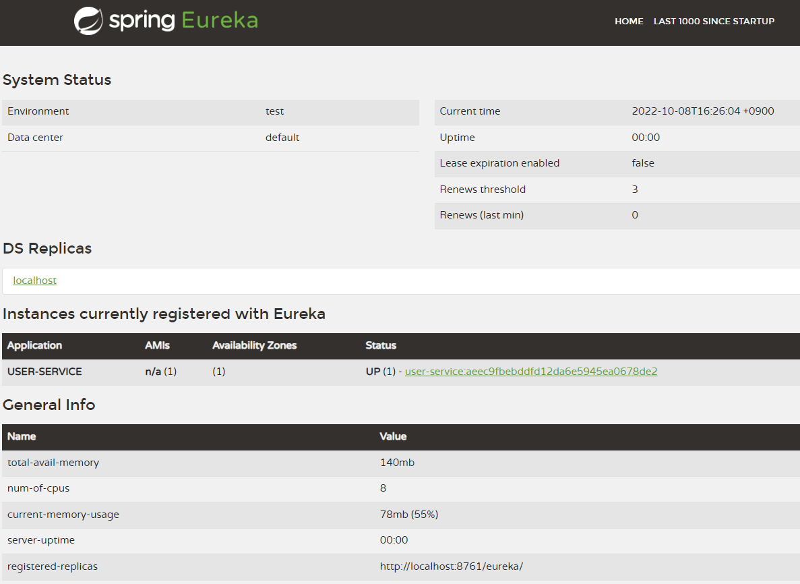

# 북스토어 마이크로서비스 등록하기

# 북스토어 유저 마이크로서비스

## 스프링부트 스타처 의존성 추가

- 스프링부트 스타터 의존성
  - Eureka Discovery Client

```xml
<dependency>
  <groupId>org.springframework.cloud</groupId>
  <artifactId>spring-cloud-starter-netflix-eureka-client</artifactId>
</dependency>
```

- 메인 클래스 정의하기

```java
@SpringBootApplication
// 유레카 클라이언트를 활성화시킨다.
@EnableDiscoveryClient
public class UserServiceApplication {

  public static void main(String[] args) {
    SpringApplication.run(UserServiceApplication.class, args);
  }

}
```

- application.yml 설정하기

```yml
# 애플리케이션의 이름을 지정한다.
spring:
  application:
    name: user-service

# Random 포트 사용으로 같은 서비스를 여러개 실행할 경우 각각의 인스턴스를 구분하기 위해서 인스턴스 정보를 설정한다.
# instance-id는 유레카 서버가 인식할 인스턴스 아이디를 지정한다. 유레카서버 대시보드에서 서비스를 식별할 수 있게 한다.
# register-with-eureka는 유레카 서버(레지스트리)에 이 애플리케이션을 유레카 클라이언트로 등록할지 여부를 지정한다.
# fetch-registry는 레지스트리에서 정보를 가져올지 여부를 지정한다. 30초마다 유레카 클라이언트가 유레카 레지스트리 변경 사항 여부를 재확인한다.
# defaultZone는 유레카 서버가 위치하고 있는 기본 주소를 지정한다.
eureka:
  instance:
    instance-id: ${spring.application.name}:${spring.applcation.application-id:${random.value}}
  client:
    register-with-eureka: true
    fetch-registry: true
    service-url:
      defaultZone: http://localhost:8761/eureka/
```

## 유레카 서버에서 유저 마이크로서비스 등록 확인하기

- 유레카 서버 대시보드 접속하기

```text
http://localhost:8761
```

- 유레카 서버 대시보드에서 레지스트리에 등록된 USER-SERVICE 확인하기


- **Instances currently registered with Eureka** 항목에 **USER-SERVICE**가 등록되었음을 확인할 수 있다.
