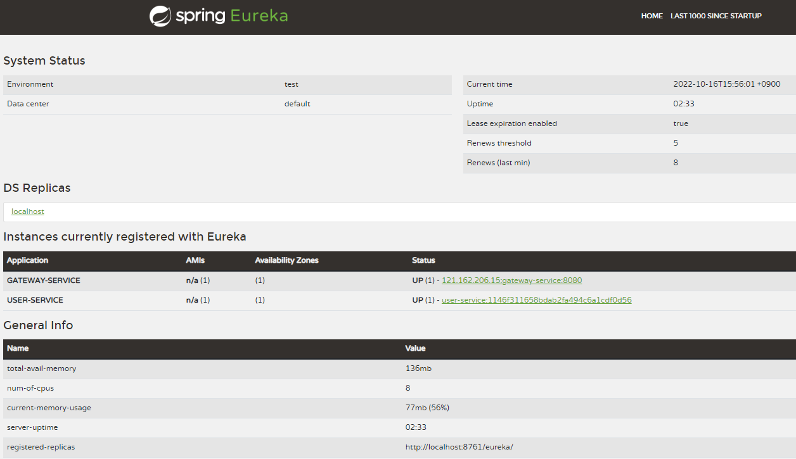
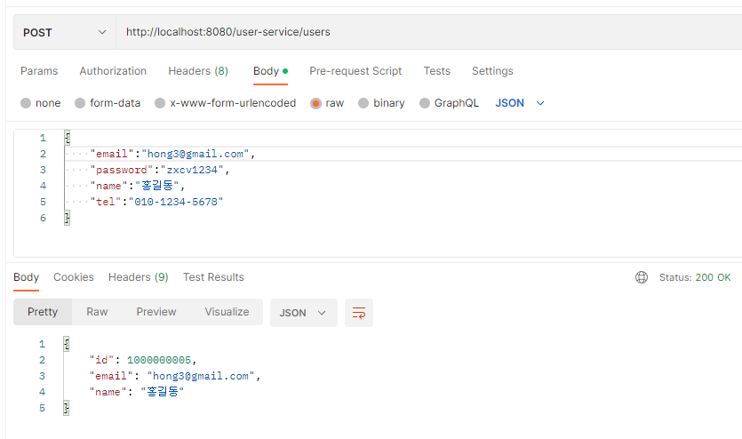
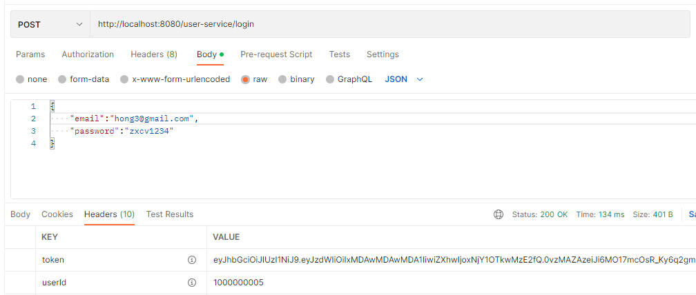

# 북스토어 Spring Cloud Gateway

## 프로젝트 생성

- 프로젝트명
  - api-gatway
- 스프링부트
  - 2.6.12
- 스프링부트 스타터 의존성
  - Spring Boot DevTools
  - Eureka Discovery Client
  - Gateway

```xml
<dependency>
  <groupId>org.springframework.cloud</groupId>
  <artifactId>spring-cloud-starter-gateway</artifactId>
</dependency>
<dependency>
  <groupId>org.springframework.cloud</groupId>
  <artifactId>spring-cloud-starter-netflix-eureka-client</artifactId>
</dependency>

<dependency>
  <groupId>org.springframework.boot</groupId>
  <artifactId>spring-boot-devtools</artifactId>
  <scope>runtime</scope>
  <optional>true</optional>
</dependency>
```

- 메인 클래스 정의

```java
@SpringBootApplication
public class ApiGatewayApplication {

  public static void main(String[] args) {
    SpringApplication.run(ApiGatewayApplication.class, args);
  }
}
```

- application.yml 설정하기

```yml
# Spring Cloud Gateway의 포트번호 지정
server:
  port: 8080

# Spring Cloud Gateway 애플리케이션을 유레카 서버에 등록시킨다.
eureka:
  client:
    register-with-eureka: true
    fetch-registry: true
    service-url:
      defaultZone: http://localhost:8761/eureka/
# Spring Cloud Gateway 애플리케이션의 이름을 gateway-service로 지정한다.      
spring:
  application:
    name: gateway-service
# Spring Cloud Gateway 라우트 정보를 설정한다.
  cloud:
    gateway:
      routes:
# 로그인 요청에 대한 라우트 설정이다.
# POST 방식의 http://localhost:8080/user-service/login 요청에 대한 라우트 설정이다.
# 이 라우트의 고유한 id는 user-service-login 인다.
# 이 라우트의 목적지 URI는 lb://USER-SERVICE다. 
# 이 라우트의 매핑되는 요청경로는 /user-service/login이고, 요청방식은 POST다.
# 이 라우트에 설정된 필터는 RemoveRequestHeader와 RewritePath 필터다.
# RemoveRequestHeader는 Request 헤더에 저장된 Cookie 값을 제거한다.
# RewritePath는 정규표현식을 사용해서 유연하게 HTTP Request Path를 변경한다.
# RewritePath=/user-service/(?<segment>.*), /$\{segment}는 HTTP Request Path에서 /user-service를 제거한다.
        - id: user-service-login
          uri: lb://USER-SERVICE
          predicates:
            - Path=/user-service/login
            - Method=POST
          filters:
            - RemoveRequestHeader=Cookie
            - RewritePath=/user-service/(?<segment>.*), /$\{segment}
# 회원가입에 대한 라우트 설정이다.
# POST 방식의 http://localhost:8080/user-service/users 요청에 대한 라우트 설정이다.
        - id: user-service-create-user
          uri: lb://USER-SERVICE
          predicates:
            - Path=/user-service/users
            - Method=POST
          filters:
            - RemoveRequestHeader=Cookie
            - RewritePath=/user-service/(?<segment>.*), /$\{segment}
# 위에서 정의한 2가지 라우팅 http://localhost:8080/user-service/login 요청에 대한 라우트 설정이다.
        - id: user-service-required-authentication
          uri: lb://USER-SERVICE
          predicates:
            - Path=/user-service/**
            - Method=GET
          filters:
            - RemoveRequestHeader=Cookie
            - RewritePath=/user-service/(?<segment>.*), /$\{segment}
```

## 유레카 서버에서 API Gateway 등록 확인하기

- 유레카 서버 대시보드 접속하기

```text
http://localhost:8761
```



- **Instances currently registered with Eureka** 항목에 **GATEWAY-SERVICE**가 등록되었음을 확인할 수 있다.

## API Gateway의 서비스 라우팅 확인하기

- 회원가입하기 테스트



- 로그인 테스트



- 응답 **Headers** 항목에 **JWT**를 확인할 수 있다.