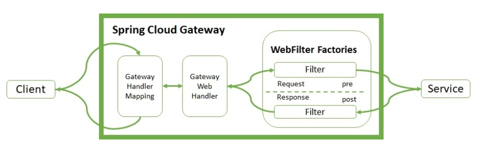

# 마이크로서비스에 필터 적용하기

- Spring Cloud Gateway는 마이크로서비스에가 자주 사용되는 지능형 프록시 서버다.
- 단일 진입점으로써 클라이언트의 요청을 투명하게 중앙 집중화하고 적절한 마이크로서비스로 라우팅한다.
- Spring Cloud Gateway는 프록시된 마이크로서비스에 대한 전처리/후처리(HTTP 요청과 HTTP 응답과 상호작용하는 작업) 작업을 지원하는 WebFilter 팩토리를 제공한다.
- Spring Cloud Gateway에서는 내장된 WebFilter 팩토리와 사용자 정의 필터를 사용할 수 있다.

## WebFilter Factories

- WebFilter(GatewayFilter) Factories는 인바운드 HTTP 요청과 아웃바운드 HTTP 응답을 수정할 수 있다.

- 게이트웨이 핸들러 매핑은 클라이언트의 요청을 관리한다.
- 게이트웨이 핸들러 매핑은 설정된 경로와 일치하는 요청인지 확인하고, 지정된 경로에 대한 필터 체인을 실행하기 위해서 웹 핸들러에 요청을 보낸다.
- 입력필터는 마이크로서비스 실행 전에 실행되고, 출력필터는 마이크로서비스 실행후에 실행된다.
- 스프링 클라우드 내장 WebFilter
  - ADD : AddRequestHeader, AddRequestParameter
  - Map : MapRequestHeader
  - Set or Replace : SetRequestHeader, SetResponseHeader
  - Remove : RemoveRequestHeader, RemoveRequestParameter, RemoveResponseHeader
  - Rewrite : RewriteResponseHeader

## WebFilter 실행우선 순위

- 우선 순위는 order 인자값을 통해서 변경가능하다.

## 스프링 클라우드 내장 WebFilter 사용하기

### 자바코드기반 필터 설정

- FilterConfig.java 클래스를 정의하고, 필터 설정 정보가 정의된 RouterLocator객체를 빈으로 등록한다.

### application.yml 기반 필터 설정
